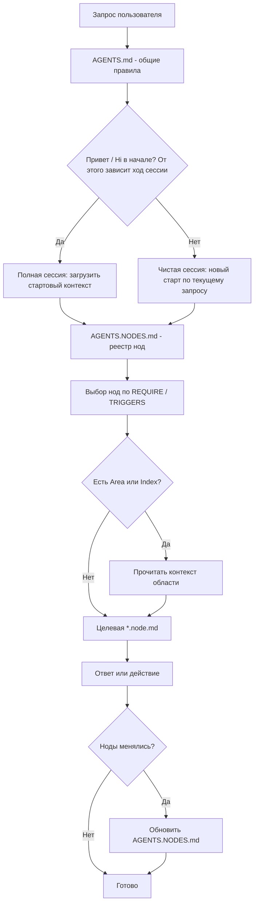

# AWN Framework — простое описание проекта

![[Preview.png]]

Этот проект — каркас для работы человека и AI-ассистента в Obsidian.

**AWN Framework (Agent Workspace Nodes)** — это каркас для агентных workspace на базе Markdown в Obsidian: единые правила в `AGENTS.md`, атомарные ноды в `*.node.md` и единый реестр в `AGENTS.NODES.md`.

Подход подходит не только для Obsidian-vault, но и для OpenClaw-подобных систем и других agent workspace, где правила, память и структура среды хранятся в файлах проекта.

Главная цель AWN: превратить набор заметок в предсказуемую среду, где человек и агент работают по одному протоколу, без хаоса в контексте и без дублирования знаний.

**Единственный полный справочник по правилам, полям YAML и протоколам — `AGENTS.md`.** Этот файл — короткий вход для человека: что это за framework, как он устроен и как им пользоваться на практике.

Главная идея:

- мы храним правила и память в Markdown;
- знания делим на небольшие ноды (`*.node.md`);
- агент читает только то, что нужно по ситуации.

## Оглавление

- [[#Что это простыми словами|Что это простыми словами]]
- [[#Что такое нода|Что такое нода]]
- [[#Основные принципы|Основные принципы]]
- [[#Как агент читает контекст|Как агент читает контекст]]
- [[#Как это работает (поток)|Как это работает (поток)]]
- [[#Схема потока (текст)|Схема потока (текст)]]
- [[#Схема потока (Mermaid)|Схема потока (Mermaid)]]
- [[#Полная и чистая сессия|Полная и чистая сессия]]
- [[#Минимальный состав файлов проекта|Минимальный состав файлов проекта]]
- [[#Примеры организации хранилища заметок|Примеры организации хранилища заметок]]
- [[#Как агент использует `*.node.md`|Как агент использует `*.node.md`]]
- [[#Как начать (5 шагов)|Как начать (5 шагов)]]
- [[#Протокол обновления нод|Протокол обновления нод]]
- [[#Стартовые файлы агентов|Стартовые файлы агентов]]
- [[#Зачем это нужно|Зачем это нужно]]
- [[#Куда смотреть дальше|Куда смотреть дальше]]

---

## Что это простыми словами

AWN Framework (Agent Workspace Nodes) помогает превратить "хаотичные заметки" в понятную систему:

- есть один главный файл правил: `AGENTS.md`;
- есть реестр нод: `AGENTS.NODES.md`;
- есть сами ноды (`*.node.md`) в папках проекта;
- есть точки входа для разных агентов: `CLAUDE.md`, `QWEN.md`, `GEMINI.md`, `CODEX.md`.

Это не жесткий фреймворк с обязательным деревом папок.
Структуру папок выстраивает сам пользователь.

---

## Что такое нода

Нода (`*.node.md`) — это небольшой модуль знаний:

- правило;
- навык;
- описание поведения;
- контекст конкретной области.

Дополнительно можно делать:

- `Area.node.md` — правила/контекст папки или области;
- `Index.node.md` — входная карта папки.

Они полезны, но не обязательны.

### Метафора: нейроны и связи

Для простого понимания можно представить, что каждая `*.node.md` — это нейрон в цифровом мозге.

- Нода хранит паттерн: знание, правило или контекст.
- Нода активируется по триггерам, когда агенту нужен именно этот кусок смысла.
- Связи `[[...]]` между файлами можно понимать как синапсы: через них знания связываются и передают контекст.
- Вместе такие ноды образуют адаптивную когнитивную сеть, а не просто набор заметок.

Иначе говоря, здесь файл нужен не только для хранения текста, но и как рабочая единица мышления и поведения агента. При этом в файловой системе мы сохраняем простое техническое имя `*.node.md`, чтобы не усложнять поиск, скрипты и повседневную работу.

---

## Основные принципы

1. Не дублировать смысл:
   - не повторять одно и то же внутри одного файла;
   - не копировать одинаковые блоки по разным файлам.
2. Одна нода = одна договоренность/тема.
3. Пути в реестре только относительные (от корня проекта).
4. Секреты хранятся в корневом `.env`, не в git.

---

## Как агент читает контекст

На старте сессии:

1. читает `AGENTS.md`;
2. читает `AGENTS.NODES.md`;
3. подгружает только ноды со статусом загрузки `start` ("при старте").

Ноды `on_demand` ("по необходимости") на старте не читаются.
Они читаются только когда запрос совпадает с триггерами ноды.

---

## Как это работает (поток)

1. Пользователь начинает сессию: если в начале звучит приветствие вроде **«Привет»**, это полная сессия и загружаются стартовые контексты и ноды; если приветствия нет и сразу идет задача, это чистая сессия, без подгрузки контекста и нод.
2. Агент читает `AGENTS.md`.
3. Затем читает `AGENTS.NODES.md`.
4. Выбирает нужные ноды по `REQUIRE` и `TRIGGERS`.
5. При необходимости смотрит `Area.node.md` или `Index.node.md`.
6. Формирует ответ или выполняет задачу в нужном контексте.
7. Если ноды менялись, обновляет `AGENTS.NODES.md`.

---

## Схема потока (текст)

```text
Пользователь пишет запрос
        |
        v
Агент читает AGENTS.md (общие правила)
        |
        v
Есть "Привет" / "Hi" в начале?
От этого зависит, как дальше пойдет сессия
        |
   +----+----+
   |         |
  да        нет
   |         |
   v         v
Полная    Чистая
сессия:   сессия:
загружает новый старт
стартовый по текущему
контекст  запросу
   |         |
   +----+----+
        |
        v
Агент читает AGENTS.NODES.md (реестр нод)
        |
        v
Ищет подходящие ноды по REQUIRE / TRIGGERS
        |
        v
Есть ли рядом Area.node.md или Index.node.md?
        |
   +----+----+
   |         |
  да        нет
   |         |
   v         v
Читает   Переходит сразу
контекст к целевой ноде
области
   |         |
   +----+----+
        |
        v
Читает целевую *.node.md
        |
        v
Формирует ответ или выполняет действие
        |
        v
Если ноды изменились -> обновляет AGENTS.NODES.md
```

## Схема потока (Mermaid)



---

## Полная и чистая сессия

- Если сообщение начинается с приветствия (например, "Привет", "Hi"), включается полная сессия.
- Если приветствия нет, это чистая сессия: агент не подмешивает лишний контекст и опирается на текущую задачу.
- Опционально список триггеров полной сессии можно хранить в `.env`, например через `FULL_SESSION_TRIGGERS`.

---

## Минимальный состав файлов проекта

- `AGENTS.md` — правила среды;
- `AGENTS.NODES.md` — реестр нод;
- `AGENTS.NODES.EXAMPLE.md` — примеры;
- `README.md` / `README-NEW.md` — описание для людей;
- `*.node.md` — рабочие ноды;
- `.env` — локальные настройки.

---

## Примеры организации хранилища заметок

Ниже два примера структуры. Это не обязательный стандарт, а иллюстрации, которые можно адаптировать под свой стиль работы.

### Вариант 1. Пример структуры рабочего стола

Кратко: папки разбиты по смысловым зонам. Внутри можно держать обычные заметки, а при необходимости добавлять `Area.node.md` и `Index.node.md`.

**Пример дерева (иллюстрация, имена папок и файлов можно менять под себя):**

Внутри папок показаны типичные ноды: `Area.node.md` — что за область и что здесь живет; `Index.node.md` — по желанию вход в папку. В корне экосистемы удобно держать паспорт агента и профиль пользователя отдельными нодами.

```text
vault/
├── 00 🍀 Aya.AI/                  # ядро: правила экосистемы
│   ├── Area.node.md               # что в этой папке и зачем она
│   ├── Assistant.node.md          # цифровой паспорт агента
│   └── User.node.md               # кто пользователь
├── 01 🎯 Focus/                   # текущие приоритеты и фокус
├── 02.01 🧠 Atlas/                # база знаний, MOC, связи
├── 02.02 🎓 Courses/              # обучение, курсы, конспекты
├── 03 🔨 Forge/                   # проекты, "кузница"
│   ├── Area.node.md
│   └── ProjectName/
│       ├── Area.node.md
│       └── Brief.node.md          # пример ноды под один проект
├── 04 🎨 Hobby/
├── 05 🌍 Life/                    # быт, личное
├── 06 📥 Inbox/                   # захват без сортировки
├── 06 📤 Outbox/                  # готово к отправке / экспорту
├── 07 📦 Vault/                   # вложения, медиа, долгое хранение
├── 08 ❄️ Archive/
├── 09 💻 Soft/                    # софт, инструменты
├── 10 💬 Chats/                   # логи диалогов (по желанию)
├── AGENTS.md                      # корень vault: системные файлы проекта
├── AGENTS.NODES.md
├── .env                           # локальные настройки и секреты
├── .env.example                   # шаблон настроек
├── CLAUDE.md
├── QWEN.md
├── GEMINI.md
└── CODEX.md
```

Имена файлов в подпапках могут быть любыми или их может не быть вовсе: `Area.node.md` и `Index.node.md` не обязательны. Достаточно одной `Area.node.md` на папку или только контент-нод без отдельной обложки области.

Заметка про `Inbox` и `Outbox`: если одинаковый префикс `06` мешает навигации, их можно развести по номерам или объединить в одну папку с подпапками.

Приемы из примера:

- Префиксы вроде `00 ... 10` помогают держать предсказуемый порядок в проводнике без ручной сортировки.
- Эмодзи в именах папок работают как быстрые визуальные якоря.
- Подпапки вида `02.01` / `02.02` позволяют держать близкие разделы рядом, но не смешивать их.
- Файлы агента (`AGENTS.md`, `AGENTS.NODES.md`, точки входа) удобнее держать в корне vault или в папке ядра, если рабочая директория агента совпадает с корнем проекта.
- Ноды `*.node.md`, а также `Area.node.md` и `Index.node.md`, можно создавать в любой папке; пути в `AGENTS.NODES.md` при этом остаются относительными от корня проекта.

### Вариант 2. Пример структуры на основе PARA

Кратко: если тебе ближе классический подход к знаниям, можно построить vault по модели PARA: `Projects`, `Areas`, `Resources`, `Archive`.

```text
vault/
├── 00 🍀 Aya.AI/                  # ядро системы и служебные ноды
│   ├── Area.node.md
│   ├── Assistant.node.md
│   └── User.node.md
├── 01 🚀 Projects/                # активные проекты с конкретным результатом
│   ├── Area.node.md
│   └── ProjectName/
│       ├── Area.node.md
│       ├── Brief.node.md
│       └── Tasks.md
├── 02 🌍 Areas/                   # постоянные зоны ответственности
│   ├── Health/
│   ├── Finance/
│   ├── Work/
│   └── Learning/
├── 03 📚 Resources/               # материалы, заметки, идеи, справка
│   ├── Articles/
│   ├── Courses/
│   ├── Atlas/
│   └── References/
├── 04 ❄️ Archive/                 # завершенное и неактуальное
├── 05 📥 Inbox/                   # быстрый захват
├── AGENTS.md
├── AGENTS.NODES.md
├── .env
├── .env.example
├── CLAUDE.md
├── QWEN.md
├── GEMINI.md
└── CODEX.md
```

Что такое `PARA`: это популярный способ организации личных знаний и файлов, где папки делятся на `Projects`, `Areas`, `Resources`, `Archive`.

- `Projects` — активные проекты с конкретным результатом.
- `Areas` — постоянные сферы ответственности.
- `Resources` — материалы, заметки и справка.
- `Archive` — завершенное или неактуальное.

В PARA-структуре ноды работают так же: `*.node.md` можно держать внутри проектов, областей и ресурсов. Разница только в организации папок, а не в самом протоколе AWN.

---

## Как агент использует `*.node.md`

Подробные правила поведения агента находятся в `AGENTS.md`, а здесь короткая последовательность:

1. Пользователь задает вопрос или ставит задачу.
2. Агент ищет подходящую ноду по `TRIGGERS` и режиму загрузки `REQUIRE`.
3. Перед чтением целевой ноды агент проверяет, есть ли рядом `Area.node.md` или `Index.node.md`.
4. Если такие файлы есть, агент сначала читает их, чтобы понять контекст области, тон и локальные правила.
5. Затем агент читает целевую `*.node.md` и отвечает уже в нужном контексте.

---

## Как начать (5 шагов)

По умолчанию в проекте уже есть одна нода-пример: `Nodes/RandomAnecdote.node.md` ("Случайный анекдот"). На ней можно посмотреть базовую структуру `*.node.md`, YAML-шапку и способ описания поведения ноды.

1. Определи, **что именно должна делать нода**: какую тему, правило, навык или контекст ты хочешь зафиксировать.
   Что происходит под капотом: агент понимает, к какому типу знаний относится будущая нода и в какой папке её логичнее создать.
1. Если уже есть идея имени, сформулируй её коротко. Если имени нет, достаточно обычного описания своими словами.
   Что происходит под капотом: агент может предложить подходящее имя файла, `TITLE` и краткое `DESCRIPTION`.
1. Попроси агента создать ноду.
   Что происходит под капотом: агент смотрит, достаточно ли информации для создания файла и не дублирует ли новая нода уже существующий смысл.
1. Если из запроса что-то неясно, агент сам задаст уточняющие вопросы: про тему, назначение, триггеры, область применения, режим загрузки и имя файла.
   Что происходит под капотом: на этом этапе определяется структура ноды, нужные YAML-поля и логика её активации.
1. После согласования агент создаст ноду, заполнит нужные поля и обновит запись в `AGENTS.NODES.md`.
   Что происходит под капотом: создаётся сам `*.node.md`, заполняются поля вроде `TYPE`, `TITLE`, `DESCRIPTION`, `REQUIRE`, `TRIGGERS`, `STATUS`, даты и затем нода добавляется в реестр.

---

## Протокол обновления нод

При создании, изменении или удалении любого `*.node.md`:

1. Выполнить поиск всех `*.node.md` по всему хранилищу от корня проекта.
2. Сверить найденный список с `AGENTS.NODES.md`.
3. Обновить реестр: добавить новые пути, обновить даты и статусы, убрать неактуальные записи.
4. Убедиться, что все пути в реестре остаются относительными от корня текущего проекта.
5. При необходимости обновить примеры в `AGENTS.NODES.EXAMPLE.md`.

---

## Стартовые файлы агентов

Если агент использует точки входа вроде `CLAUDE.md`, `QWEN.md`, `GEMINI.md` или `CODEX.md`:

1. Читать только локальный `./AGENTS.md` из корня этого проекта.
2. Не выходить за пределы vault без разрешения пользователя.
3. Не смешивать контекст с `AGENTS.md` из соседних каталогов.

---

## Зачем это нужно

- меньше хаоса в заметках;
- агент не читает "все подряд";
- проще поддерживать знания долгосрочно;
- проще масштабировать личную экосистему без потери структуры.

---

## Куда смотреть дальше

- Все определения, правила и таблицы полей: `AGENTS.md`.
- Рабочий реестр нод: `AGENTS.NODES.md`.
- Примеры и идеи для новых нод: `AGENTS.NODES.EXAMPLE.md`.
- Этот файл (`README-NEW.md`) — короткий вход для человека, а не полный протокол.
