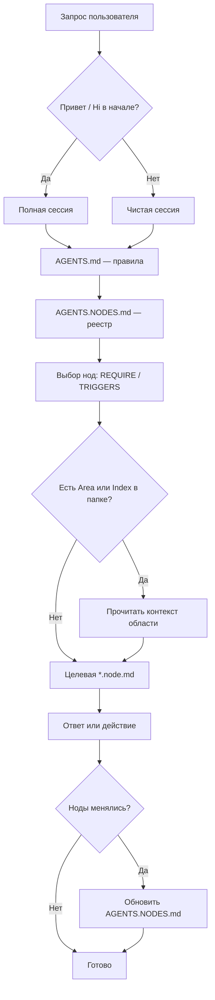

# AWN Framework

**AWN Framework (Agent Workspace Nodes)** — это каркас для агентных workspace на базе Markdown в Obsidian: единые правила в [`AGENTS.md`](AGENTS.md), атомарные ноды в `*.node.md` и единый реестр в [`AGENTS.NODES.md`](AGENTS.NODES.md).

Главная цель AWN: превратить набор заметок в предсказуемую среду, где человек и агент работают по одному протоколу, без хаоса в контексте и без дублирования знаний.

**Единственный полный справочник по правилам, полям YAML и протоколам — [`AGENTS.md`](AGENTS.md).** Этот README — вводный: что это за framework, что читать, в каком порядке и как с ним работать на практике.

---

## С чего начать

| Кто | Что открыть первым |
|-----|----------------------|
| Человек | [`AGENTS.md`](AGENTS.md) (протокол и определения), затем при необходимости [`AGENTS.NODES.md`](AGENTS.NODES.md) и [`AGENTS.NODES.EXAMPLE.md`](AGENTS.NODES.EXAMPLE.md). |
| Агент с точкой входа | Стартовый файл (`CLAUDE.md`, `QWEN.md`, …) → обязательно только [`./AGENTS.md`](AGENTS.md) из **корня этого проекта** (см. раздел [Стартовые файлы агентов](#стартовые-файлы-агентов)). |

Порядок чтения для агента зафиксирован в [`AGENTS.md`](AGENTS.md) (раздел «Реестр узлов»): сначала правила, потом реестр, потом примеры.

---

## Что такое нода (кратко)

**Нода (node)** — это **договорённость (память)** о системе, папке, файле или теме: навык, правило, описание сущности, поведение в зоне vault. Формально это **атом знания** с понятной ролью.

- **Файл ноды** везде в vault: маска имени **`*.node.md`**.
- В шапке — YAML с полями вроде `TYPE`, `TITLE`, `DESCRIPTION`, `REQUIRE`, `PRIORITET`, `TRIGGERS`, `STATUS` и др. Полный контракт и таблица полей — в [`AGENTS.md`](AGENTS.md), раздел **«4. Что такое node»** и **«Обязательные свойства YAML»**.
- После `---` идёт обычный текст: о чём узел, как действовать, границы.
- Для **папки** по соглашению можно использовать `Index.node.md` (вход в папку), для **области шире папки** — `Area.node.md`. Они **не обязательны**; если их нет — работа идёт с контент-нодами напрямую (всё это — в [`AGENTS.md`](AGENTS.md), раздел **«4. Что такое node»**).

**Жизненный цикл:** поле `STATUS`: `draft` | `active` | `archive` — подробно в [`AGENTS.md`](AGENTS.md), раздел **«Жизненный цикл нод»**.

**Имена и пути:** только **относительно корня текущего проекта**; стиль CamelCase для новых папок и нод — в [`AGENTS.md`](AGENTS.md), **«Правила создания и названия новых node и папок»**.

---

## Карта файлов и отсылки в AGENTS.md

| Файл | Зачем нужен | Где подробности |
|------|-------------|-----------------|
| [`AGENTS.md`](AGENTS.md) | Конституция среды: полная сессия, Obsidian, `.env`, принципы (DRY, KISS, …), что такое node, YAML, реестр, команды, сравнение с фреймворками | Весь документ |
| [`AGENTS.NODES.md`](AGENTS.NODES.md) | Рабочая **таблица** всех `*.node.md` (пути, статус, загрузка, приоритет, …) | [`AGENTS.md`](AGENTS.md) §6, синхронизация |
| [`AGENTS.NODES.EXAMPLE.md`](AGENTS.NODES.EXAMPLE.md) | Каталог **примеров** нод по областям (ориентир для новых) | Не реестр; реестр — только `AGENTS.NODES.md` |
| [`CLAUDE.md`](CLAUDE.md), [`QWEN.md`](QWEN.md), [`GEMINI.md`](GEMINI.md), [`CODEX.md`](CODEX.md) | Bootstrap: читать только `./AGENTS.md` из этого проекта | Текст внутри файлов |
| [`HEARTBEAT.md`](HEARTBEAT.md) | Чеклист периодических проверок для агентных систем; перед проверками прочитать `AGENTS.md` | Содержимое файла |
| [`.env`](.env) | Локальные переменные (корень проекта); секреты не коммитить; шаблон — `.env.example`, если есть | [`AGENTS.md`](AGENTS.md) §1 «Файл окружения» |

---

## Пример структуры хранилища Obsidian

В [`AGENTS.md`](AGENTS.md) нет обязательного дерева каталогов: важны **договорённости** и ноды. Ниже — **один из возможных** вариантов, как пользователь может разложить vault, чтобы порядок в списке папок был предсказуемым и читаемым.

**Приёмы из примера:**

- Префиксы **`00` … `10`** (или `01`, `02.01`) — фиксированный **порядок** в проводнике без ручной сортировки.
- **Эмодзи в имени папки** — быстрый визуальный якорь (в Obsidian это обычная практика).
- Подпапки вроде **`02.01` / `02.02`** — группа «знания»: атлас карт и курсы рядом, но раздельно.
- Файлы агента (`AGENTS.md`, `AGENTS.NODES.md`, точки входа) логично держать в **корне vault** или в папке ядра — главное, чтобы **рабочая директория агента** совпадала с корнем проекта, где лежит `./AGENTS.md` (см. [Стартовые файлы агентов](#стартовые-файлы-агентов)).
- Ноды **`*.node.md`** и при необходимости **`Area.node.md` / `Index.node.md`** можно создавать **в любой** из папок; пути в [`AGENTS.NODES.md`](AGENTS.NODES.md) остаются относительными от корня проекта.

**Пример дерева (иллюстрация, имена можно менять под себя):**

```text
vault/
├── 00 🍀 Aya.AI/        # ядро экосистемы: правила, роутер, память, навыки
├── 01 🎯 Focus/          # текущие приоритеты и фокус
├── 02.01 🧠 Atlas/       # база знаний, карты содержимого (MOC), связи
├── 02.02 🎓 Courses/     # обучение, курсы, конспекты
├── 03 🔨 Forge/          # проекты, «кузница», черновики продуктов
├── 04 🎨 Hobby/          # хобби и творчество
├── 05 🌍 Life/           # быт, личное, организация жизни
├── 06 📥 Inbox/          # входящий захват (быстрые заметки)
├── 06 📤 Outbox/         # исходящее: готовое к отправке / экспорту
├── 07 📦 Vault/          # долгое хранение вложений, медиа, архив полезного
├── 08 ❄️ Archive/        # неактивное, завершённое, история без шума
├── 09 💻 Soft/           # софт, настройки инструментов, техника
└── 10 💬 Chats/          # логи диалогов с агентами (по желанию)
```

**Заметка про Inbox и Outbox:** на скриншоте у обоих может быть один префикс `06` — вход и выход рядом по смыслу. Если одинаковый номер мешает в списке, разведи префиксы и **перенумеруй хвост** (например Inbox `06`, Outbox `07`, Vault `08`, Archive `09` и т.д.) или сделай одну папку «потоки» с подпапками `Inbox` / `Outbox`.

Это **не** часть обязательного контракта: можно взять только идею префиксов и эмодзи, а содержимое папок настроить под свой домен.

---

## Полная сессия и чистая сессия

Правило из [`AGENTS.md`](AGENTS.md), раздел **«Условие „полной сессии“»**:

- Если **в начале** сообщения есть приветствие (**«Привет»**, **«Hi»** и т.п.) — **полная сессия**: учитывается весь протокол, реестр, ноды с загрузкой «при старте» и т.д.
- Если приветствия **нет** — **чистая сессия**: опора на явную задачу и приложенные файлы, без автоматической прогрузки всего реестра по умолчанию.

Опционально список триггеров можно отразить в `.env` (например, `FULL_SESSION_TRIGGERS`).

---

## Как этим пользоваться (человеку)

1. Прочитай [`AGENTS.md`](AGENTS.md), чтобы понять границы vault, формат нод и таблицу полей YAML.
2. Создай файл `ИмяСущности.node.md` в нужной папке (или добавь `Index.node.md` / `Area.node.md`, если нужен локальный контекст — см. [`AGENTS.md`](AGENTS.md) §4).
3. Заполни YAML по контракту из [`AGENTS.md`](AGENTS.md); под текстом опиши смысл и правила.
4. Обнови реестр: выполни поиск всех `*.node.md` по проекту и синхронизируй [`AGENTS.NODES.md`](AGENTS.NODES.md) (шаги — в разделе [Протокол обновления нод](#протокол-обновления-нод) ниже и в [`AGENTS.md`](AGENTS.md) §6).
5. При необходимости добавь черновую карточку в [`AGENTS.NODES.EXAMPLE.md`](AGENTS.NODES.EXAMPLE.md) как **пример**, не путая с реестром.

**Основные действия** (дословно из [`AGENTS.md`](AGENTS.md) §7): создать/изменить/удалить ноду; создать/изменить/удалить `Area.node.md` / `Index.node.md`; правки в корневом `.env`; обновить карту в `AGENTS.NODES.md`.

---

## Как это работает (поток)

1. Пользователь начинает сессию (**«Привет»** — полная; сразу задача — чистая).
2. Агент опирается на [`AGENTS.md`](AGENTS.md).
3. Агент читает [`AGENTS.NODES.md`](AGENTS.NODES.md).
4. Выбирает ноды по `REQUIRE` / `TRIGGERS` (см. расшифровку загрузки в [`AGENTS.NODES.md`](AGENTS.NODES.md) и [`AGENTS.md`](AGENTS.md) §6).
5. Формирует ответ с учётом контекста, при необходимости — `Area.node.md` / `Index.node.md`.
6. После изменений нод — обновляет реестр по протоколу.

---

## Схема потока (текст)

```text
Пользовательский запрос
        |
        v
AGENTS.md (правила)  ...............  полный текст: AGENTS.md
        |
        v
AGENTS.NODES.md (реестр)
        |
        v
Поиск релевантных node по TRIGGERS / REQUIRE
        |
        v
Проверка Area.node.md / Index.node.md в области (если есть)
        |
        v
Чтение целевой *.node.md + ответ
        |
        v
Обновление реестра при изменениях
```

## Схема потока (Mermaid)

Рендерится в GitHub, Obsidian (с плагином), многих редакторах с поддержкой Mermaid.



---

## Как агент использует `*.node.md` (простой алгоритм)

Подробные правила поведения агента — в [`AGENTS.md`](AGENTS.md); ниже — краткая последовательность.

1. Пользователь задал вопрос или поставил задачу.
2. Агент ищет ноду по триггерам (`TRIGGERS`) и режиму загрузки (`REQUIRE`).
3. Перед чтением целевой ноды проверяет: есть ли в этой области `Area.node.md` или `Index.node.md` (см. [`AGENTS.md`](AGENTS.md) §4).
4. Если есть — читает их, чтобы понять контекст раздела, тон, правила, связи с другими файлами.
5. Затем читает целевую ноду и даёт ответ в нужном контексте.

---

## Протокол обновления нод

При создании, изменении или удалении любого `*.node.md` (полный протокол в [`AGENTS.md`](AGENTS.md) §6):

1. Выполнить поиск всех `*.node.md` по всему хранилищу (от корня проекта).
2. Сверить список с [`AGENTS.NODES.md`](AGENTS.NODES.md).
3. Обновить реестр: новые пути, актуальные даты/статусы, удалить не существующие.
4. Убедиться, что пути **относительные** от корня текущего проекта.
5. При необходимости обновить примеры в [`AGENTS.NODES.EXAMPLE.md`](AGENTS.NODES.EXAMPLE.md).

---

## Стартовые файлы агентов

Если инструмент агента подхватывает `CLAUDE.md`, `QWEN.md`, `GEMINI.md` или `CODEX.md`:

1. Читать только [`./AGENTS.md`](AGENTS.md) из **корня этого проекта** (не родительские папки).
2. Не выходить за пределы vault без разрешения пользователя (см. [`AGENTS.md`](AGENTS.md) §1).
3. Не смешивать контекст с `../AGENTS.md` в других каталогах — см. формулировки в [`CLAUDE.md`](CLAUDE.md) / [`QWEN.md`](QWEN.md).

---

## Куда смотреть дальше

- Все определения и таблицы полей: **[`AGENTS.md`](AGENTS.md)**.
- Рабочий список нод: **[`AGENTS.NODES.md`](AGENTS.NODES.md)**.
- Вдохновение для новых нод: **[`AGENTS.NODES.EXAMPLE.md`](AGENTS.NODES.EXAMPLE.md)**.
