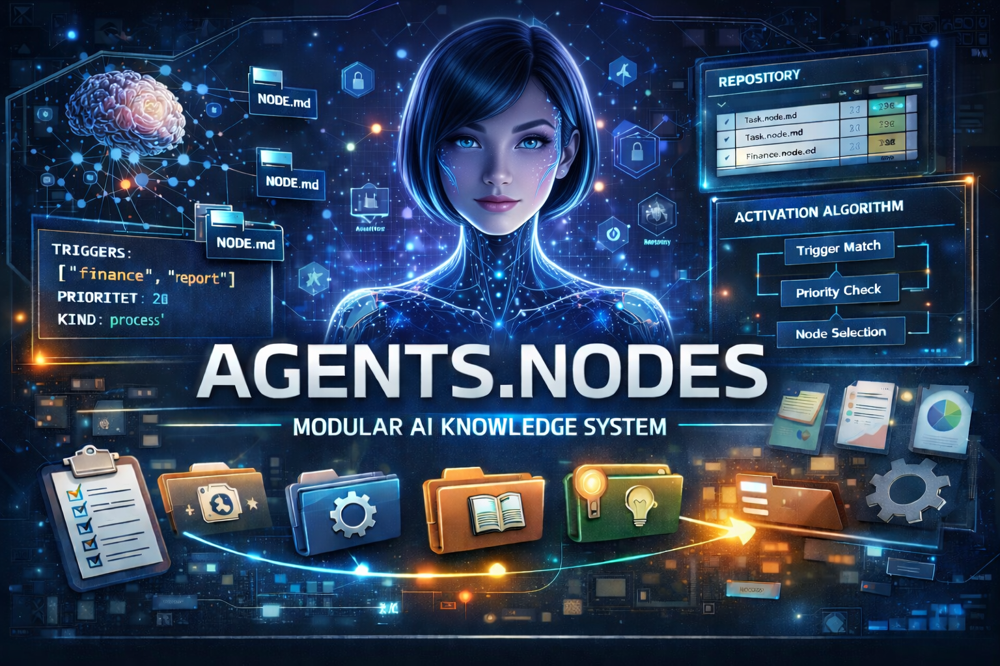
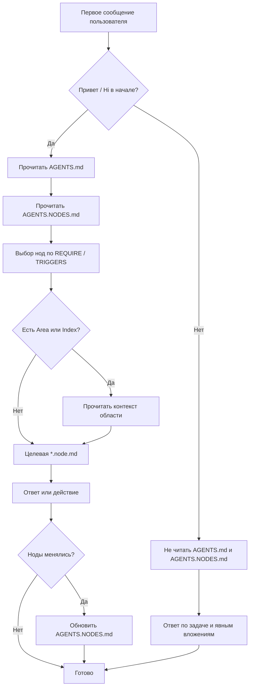

# AWN Framework (Agent Workspace Nodes) — простой гибкий фреймворк для агентных систем на базе нод



AI-native PKM, где агент является полноценным жителем системы, а не просто инструментом -)

Данный проект является исследовательской работой и попыткой найти и организовать понятную и устойчивую среду для себя и своего цифрового спутника — агента / ассистента, который работает рядом с вами, помнит договоренности и помогает не терять контекст ваших обсуждений и договоренностей в долгосрочной перспективе, где человек и агент могут разговаривать на одинаковом и понятном друг для друга языке.

Проект представляет собой образец каркаса из "нод" на базе которых человека и AI-ассистент (агент) взаимодействуют на общем языке с похожими принципами и подходами к построению своей личной интеллектуальной базы знаний ("Второй мозг"), цифровой экосистемы и будущих «когнитивных ОС» на многие годы (надеюсь когда то будет и такое в нашей жизни - будет что передать и показать AGI).

---

**AWN Framework (Agent Workspace Nodes)** — это каркас для агентных workspace на базе Markdown: единые правила в `AGENTS.md`, атомарные ноды в `*.node.md` и единый реестр в `AGENTS.NODES.md`.

Описанные принципы подходят для любых агентских систем (Claude Cowork, Gemini Cli, OpenClaw, ZeroClaw, CoPaw и других) и хранилищ с заметами на базе Obsidian — чьи правила, память и структура хранятся в md-файлах.

В этом репозитории также собраны материалы и “общение” с различными нейронными сетями по папкам: там находятся идеи, эксперименты и наработки, которые со временем могут найти отражение в `AGENTS.md` (как уточнения правил, терминов и протоколов).

Главная цель AWN: превратить набор заметок в предсказуемую среду, где человек и агент работают по одному протоколу, без хаоса в контексте и без дублирования знаний.

**Единственный полный справочник по правилам, полям YAML и протоколам — `AGENTS.md`.** Для агента этот файл (и реестр `AGENTS.NODES.md`) подключаются только в **полной** сессии — когда первое сообщение начинается с приветствия вроде «Привет» или «Hi»; подробнее в начале `AGENTS.md`. Этот `README.md` — короткий вход для человека: что это за framework, как он устроен и как им пользоваться на практике.

> [!IMPORTANT]
> Стартовый пакет AWN изначально обезличен: агент пока не знает, кто вы и какова его собственная роль.
> 
> Чтобы добавить личный контекст и сделать работу точнее, создайте две базовые ноды:
> - `Assistant.node.md` — цифровой паспорт агента: имя, роль, стиль общения, образ и границы поведения.
> - `User.node.md` — краткое описание вас: как к вам обращаться, ваши цели, предпочтения и ограничения.
> 
> Эти две ноды задают фундамент для персональной и устойчивой работы системы.

Главная идея:

- мы храним правила и память в Markdown;
- знания делим на небольшие ноды (`*.node.md`);
- агент читает только то, что нужно по ситуации.

## Что это дает на практике

Теперь взаимодействие человека и агента превращается в синергию `1+1`. Агент больше не просто отвечает на вопросы, а работает внутри твоего цифрового сада: соблюдает установленные границы, использует нужные инструменты в нужный момент и активирует релевантные ноды тогда, когда они срабатывают по триггерам.

Подход к созданию Contextual Time Archive через логи, память и узлы получает твердую техническую базу: Obsidian-хранилище, понятную структуру, `*.node.md` как рабочие единицы памяти и четкие YAML-контракты.

## Оглавление

- [Что это дает на практике](#что-это-дает-на-практике)
- [Что это простыми словами](#что-это-простыми-словами)
- [Почему здесь нет жёсткой схемы и проблемы архитектур](#почему-здесь-нет-жёсткой-схемы-и-проблемы-архитектур)
- [Что такое нода](#что-такое-нода)
- [Основные принципы](#основные-принципы)
- [Как агент читает контекст](#как-агент-читает-контекст)
- [Проблемы с памятью](#проблемы-с-памятью)
- [Как это работает (поток)](#как-это-работает-поток)
- [Схема потока (текст)](#схема-потока-текст)
- [Схема потока (Mermaid)](#схема-потока-mermaid)
- [Полная и чистая сессия](#полная-и-чистая-сессия)
- [Минимальный состав файлов проекта](#минимальный-состав-файлов-проекта)
- [Примеры организации хранилища заметок](#примеры-организации-хранилища-заметок)
- [Как агент использует *.node.md](#как-агент-использует-nodemd)
- [Как начать](#как-начать)
- [Протокол обновления нод](#протокол-обновления-нод)
- [Стартовые файлы агентов](#стартовые-файлы-агентов)
- [Зачем это нужно](#зачем-это-нужно)
- [Куда смотреть дальше](#куда-смотреть-дальше)
- [Claude Cowork (Sonnet 4.6)](#claude-cowork-sonnet-46)
- [Отзыв OpenClaw + Deepseek (ollama/deepseek-v3.1:671b-cloud)](#отзыв-openclaw-deepseek)
- [Аналоги и похожие системы](#аналоги-и-похожие-системы)
- [TODO (черновик направлений)](#todo-черновик-направлений)

---

## Что это простыми словами

AWN Framework (Agent Workspace Nodes) помогает превратить "хаотичные заметки" в понятную систему:

- есть один главный файл правил: `AGENTS.md`;
- есть реестр нод: `AGENTS.NODES.md`;
- есть сами ноды (`*.node.md`) в папках проекта;
- есть точки входа для разных агентов: `CLAUDE.md`, `QWEN.md`, `GEMINI.md`, `CODEX.md`.

Это не жесткий фреймворк с обязательным деревом папок.
Структуру папок выстраивает сам пользователь.

---

## Почему здесь нет жёсткой схемы и проблемы архитектур

AWN не навязывает обязательное дерево каталогов и не копирует чужие workspace-конвенции как жёсткий стандарт. Здесь важны не фиксированные папки, а договорённости, реестр нод и понятные правила работы с контекстом.

На первый взгляд может показаться, что большое количество нод и обязательное обновление `AGENTS.NODES.md` — это лишняя сложность. Но на практике это такая же нормальная архитектурная рутина, как маршруты в `Laravel`, `Yii`, `Symfony`, `Bitrix` или `WordPress`: страниц, обработчиков и точек входа там тоже много, но разработчик всё равно понимает, куда идти при поломке или доработке.

Реестр нод работает по тому же принципу: открыл `AGENTS.NODES.md`, нашёл строку, увидел путь, статус, триггеры и пошёл в нужный файл. Это не перегрузка, а читаемая карта системы.

Именно поэтому такой подход особенно удобен на чужом проекте. Если знакомый или заказчик говорит “не работает нода автоматизации отчётов”, не нужно читать километры логов и гадать, как устроен его “сад”. Достаточно открыть реестр, найти ноду, увидеть где она лежит, какие у неё триггеры, какой у неё статус и что с ней связано.

Проблема жёстких архитектур и OpenClaw-подобных систем в том, что у каждого получается свой закрытый набор конвенций: где-то `SOUL.md`, где-то `MEMORY.md`, где-то `skills/`, где-то дневные логи памяти. Пока ты живёшь внутри одной системы, это терпимо; когда заходишь в чужую — начинается трение. AWN предлагает другой компромисс: минимальный контракт (`*.node.md` + YAML + `AGENTS.NODES.md`), который делает даже чужого агента читаемым.

Подробнее это раскрыто в [[AGENTS#8. Почему не жёсткие «фреймворки» и не чужие конвенции workspace|AGENTS.md -> раздел 8]], где объясняется, почему подход отличается от жёстких фреймворков и OpenClaw-подобных шаблонов.

---

## Что такое нода

Нода (`*.node.md`) — это небольшой модуль знаний:

- правило;
- навык;
- описание поведения;
- контекст конкретной области.

Дополнительно можно делать:

- `Area.node.md` — правила/контекст папки или области;
- `Index.node.md` — входная карта папки.

Они полезны, но не обязательны. Для них действует **тот же** YAML-контракт, что и для любой другой `*.node.md`: **`TYPE: CoreNode`** и тот же набор полей; роль задаёт **имя файла**, а не отдельное значение `TYPE`. Рекомендации по `REQUIRE` / `TRIGGERS` и примеры скелетов — в `AGENTS.md` (подраздел про `Index.node.md` и `Area.node.md`).

### Из чего состоит `*.node.md`

Обычно нода состоит из двух частей:

- YAML-шапка в начале файла: здесь лежат служебные поля, по которым агент понимает, что это за нода и когда её использовать.
- Основной текст после `---`: здесь уже человеческое описание, смысл ноды, правила работы, границы и нужный контекст.

Основные свойства в YAML-шапке:

- `TYPE` — тип файла. Для нод используется `CoreNode`.
- `TITLE` — короткое имя ноды.
- `DESCRIPTION` — зачем эта нода нужна и что она делает.
- `REQUIRE` — когда читать ноду: при старте (`start`) или по необходимости (`on_demand`); точная семантика одна — в `AGENTS.NODES.md`, раздел **«Как читать файл по значению „Загрузка“»**.
- `PRIORITY` — приоритет ноды относительно других.
- `TRIGGERS` — слова, темы и ситуации, по которым нода активируется.
- `AUTOMATIZATION` и `CRON` — нужна ли автоматизация и по какому расписанию она может работать.
- `STATUS` — текущее состояние ноды: `draft` (черновик), `active` (рабочая), `archive` (архивная).
- `VERSION` — версия ноды в формате `major.minor.patch` (например, `1.0.0`).
- `CREATED` и `UPDATED` — даты создания и последнего обновления.

Статус ноды особенно важен для человека:

- `draft` — идея, черновик или эксперимент;
- `active` — актуальная нода, которая используется в работе;
- `archive` — сохранена для истории, но не считается активной частью системы.

### Что можно описать в ноде

Нода может объединять разные блоки, без жёсткого деления на типы:

- назначение;
- контекст применения;
- факты и данные;
- правила и ограничения;
- процесс/алгоритм (шаги);
- триггеры;
- источники/ссылки;
- примеры;
- журнал изменений (опционально).

Блоки по смыслу:

- для **memory**: **«Факты»** и **«Обновлено»** (журнал изменений — опционально);
- для **process**: **«Шаги»** / **«Алгоритм»**;
- для **rule**: **«Ограничения»** / **«Запреты»**;
- для **reference**: **«Источники»** / **«Ссылки»**.

Именно поэтому `*.node.md` одновременно удобно читать человеку и удобно использовать агенту как рабочую единицу памяти и поведения.

### Метафора: нейроны и связи

Для простого понимания можно представить, что каждая `*.node.md` — это нейрон в цифровом мозге.

- Нода хранит паттерн: знание, правило или контекст.
- Нода активируется по триггерам, когда агенту нужен именно этот кусок смысла.
- Связи `[[...]]` между файлами можно понимать как синапсы: через них знания связываются и передают контекст.
- Вместе такие ноды образуют адаптивную когнитивную сеть, а не просто набор заметок.

Иначе говоря, здесь файл нужен не только для хранения текста, но и как рабочая единица мышления и поведения агента. При этом в файловой системе мы сохраняем простое техническое имя `*.node.md`, чтобы не усложнять поиск, скрипты и повседневную работу.

---

## Основные принципы

1. Не дублировать смысл:
   - не повторять одно и то же внутри одного файла;
   - не копировать одинаковые блоки по разным файлам.
2. Одна нода = одна договоренность/тема.
3. Пути в реестре только относительные (от корня проекта).
4. Секреты хранятся в корневом `.env`, не в git.

---

## Как агент читает контекст

Режим задаёт **первое** сообщение (см. [[#Полная и чистая сессия|Полная и чистая сессия]]):

**Полная сессия** (в начале — приветствие вроде «Привет», «Hi»):

1. читает `AGENTS.md`;
2. читает `AGENTS.NODES.md`;
3. по разделу **«Как читать файл по значению „Загрузка“»** в том же файле решает, какие строки реестра превращаются в чтение соответствующих `*.node.md` (без дублирования правил в `AGENTS.md`).

У **локальных** моделей (в т.ч. через Ollama) часто **нет** автоматического доступа к файлам vault: если реестр и целевая `*.node.md` не были реально прочитаны и не попали в контекст, модель не «видит» ни строку в `AGENTS.NODES.md`, ни `TRIGGERS` и может **галлюцинировать**, что ноды нет. Настройте оболочку так, чтобы в полной сессии файлы открывались по протоколу (или приложите их вручную). После того как нода в контексте, сопоставление с запросом допускает **очевидные опечатки** (см. ту же таблицу `on_demand` в `AGENTS.NODES.md`).

**Чистая сессия** (без такого приветствия в начале): `AGENTS.md` и `AGENTS.NODES.md` **не** читаются; в контекст попадают только формулировка задачи и явно приложённые файлы.

---

## Проблемы с памятью

Проблема памяти в OpenClaw и в других подобных agent workspace с “обычной памятью” часто выглядит одинаково: система приходит с готовыми именами и ролями файлов (например `SOUL.md`, `HEARTBEAT.md`, `MEMORY.md`, а также дневные логи формата `memory/YYYY-MM-DD.md`).

Пока ты живёшь внутри их конвенции — всё работает. Но стоит выйти за рамки — начинается трение: навыки и память либо не подгружаются, либо конфликтуют со структурой.

Самая заметная боль — свалка в памяти. Дневные логи (`memory/2026-04-16.md` и подобные) быстро превращаются в “всё подряд”. На следующий день агент загружает вчерашний файл целиком и половина контекста уходит на лишнее вроде “помню, ты спрашивал про погоду”.

Навыки при этом тоже “завязаны” на workspace-структуру: если структура не твоя, навык либо не срабатывает, либо работает не так, как ожидалось.

То, что ты строишь здесь, принципиально другое: минимальный контракт (только YAML-поля) плюс произвольные пути. Агент не знает заранее, где именно лежит файл; он знает только по реестру, какие ноды релевантны сейчас. Это гибче и делает агент-систему читаемой “на месте”.

И главное: риск “свалки” никуда не исчезает автоматически — он просто переезжает из структуры файлов в качество самих нод. Поэтому нода должна быть самодостаточной: если она логирует — логирование должно быть частью инструкции (правило “логируй, не повторяй”, ограничение объёма, критерии “что именно сохранять”).

Хороший пример — нода `Nodes/RandomAnecdote.node.md`: в ней уже есть и правило, и журнал рассказанных анекдотов. Агент читает ноду целиком, поэтому ему не нужен внешний “мануал”, чтобы понимать, как вести память.

---

## Как это работает (поток)

1. Пользователь отправляет **первое** сообщение. В **начале** есть приветствие вроде **«Привет»** или **«Hi»** — **полная сессия**; иначе — **чистая сессия**.
2. **Полная сессия:** агент читает `AGENTS.md`, затем `AGENTS.NODES.md`, выбирает ноды по `REQUIRE` и `TRIGGERS`, при необходимости смотрит `Area.node.md` или `Index.node.md`, формирует ответ; если ноды менялись — обновляет `AGENTS.NODES.md`.
3. **Чистая сессия:** агент **не** читает `AGENTS.md` и **не** читает `AGENTS.NODES.md`; отвечает по явной задаче и по явно приложённым файлам (без автоматической подгрузки реестра и стартовых нод).

---

## Схема потока (текст)

```text
Пользователь пишет первое сообщение
        |
        v
Есть "Привет" / "Hi" в начале?
        |
   +----+----+
   |         |
  да        нет
   |         |
   v         v
Полная    Чистая
сессия    сессия:
   |      без AGENTS.md
   |      и без AGENTS.NODES.md
   v           |
Читает         |
AGENTS.md      |
   |           |
   v           |
Читает         |
AGENTS.NODES.md|
   |           |
   v           v
Ищет ноды по   Ответ по задаче
REQUIRE /      и явным вложениям
TRIGGERS       |
   |           |
   v           |
Есть Area /    |
Index?         |
   |           |
   v           |
Читает         |
целевую        |
*.node.md      |
   |           |
   +-----+-----+
         |
         v
Формирует ответ или выполняет действие
         |
         v
(полная сессия) если ноды менялись -> обновляет AGENTS.NODES.md
```

## Схема потока (Mermaid)



---

## Полная и чистая сессия

- Если **первое** сообщение **начинается** с приветствия (например, «Привет», «Hi»), это **полная сессия**: читаются `AGENTS.md`, затем `AGENTS.NODES.md`, далее протокол стартовых и триггерных нод.
- Если такого приветствия в начале **нет**, это **чистая сессия**: `AGENTS.md` и `AGENTS.NODES.md` **не** читаются; агент опирается только на явную задачу в сообщении и на **явно приложённые** файлы.
- Опционально список триггеров полной сессии можно хранить в `.env`, например через `FULL_SESSION_TRIGGERS`.

---

## Минимальный состав файлов проекта

- `AGENTS.md` — правила среды;
- `AGENTS.NODES.md` — реестр нод;
- `AGENTS.NODES.EXAMPLE.md` — примеры;
- `README.md` — описание для людей;
- `*.node.md` — рабочие ноды;
- `.env` — локальные настройки.

---

## Примеры организации хранилища заметок

Ниже два примера структуры. Это не обязательный стандарт, а иллюстрации, которые можно адаптировать под свой стиль работы.

### Вариант 1. Пример структуры рабочего стола

Кратко: папки разбиты по смысловым зонам. Внутри можно держать обычные заметки, а при необходимости добавлять `Area.node.md` и `Index.node.md`.

**Пример дерева (иллюстрация, имена папок и файлов можно менять под себя):**

Внутри папок показаны типичные ноды: `Area.node.md` — что за область и что здесь живет; `Index.node.md` — по желанию вход в папку. В корне экосистемы удобно держать паспорт агента и профиль пользователя отдельными нодами.

```text
vault/
├── 00 🍀 Aya.AI/                  # ядро: правила экосистемы
│   ├── Area.node.md               # что в этой папке и зачем она
│   ├── Assistant.node.md          # цифровой паспорт агента
│   └── User.node.md               # кто пользователь
├── 01 🎯 Focus/                   # текущие приоритеты и фокус
├── 02.01 🧠 Atlas/                # база знаний, MOC, связи
├── 02.02 🎓 Courses/              # обучение, курсы, конспекты
├── 03 🔨 Forge/                   # проекты, "кузница"
│   ├── Area.node.md
│   └── ProjectName/
│       ├── Area.node.md
│       └── Brief.node.md          # пример ноды под один проект
├── 04 🎨 Hobby/
├── 05 🌍 Life/                    # быт, личное
├── 06 📥 Inbox/                   # захват без сортировки
├── 06 📤 Outbox/                  # готово к отправке / экспорту
├── 07 📦 Vault/                   # вложения, медиа, долгое хранение
├── 08 ❄️ Archive/
├── 09 💻 Soft/                    # софт, инструменты
├── 10 💬 Chats/                   # логи диалогов (по желанию)
├── AGENTS.md                      # корень vault: системные файлы проекта
├── AGENTS.NODES.md
├── .env                           # локальные настройки и секреты
├── .env.example                   # шаблон настроек
├── CLAUDE.md
├── QWEN.md
├── GEMINI.md
└── CODEX.md
```

Имена файлов в подпапках могут быть любыми или их может не быть вовсе: `Area.node.md` и `Index.node.md` не обязательны. Достаточно одной `Area.node.md` на папку или только контент-нод без отдельной обложки области.

Заметка про `Inbox` и `Outbox`: если одинаковый префикс `06` мешает навигации, их можно развести по номерам или объединить в одну папку с подпапками.

Приемы из примера:

- Префиксы вроде `00 ... 10` помогают держать предсказуемый порядок в проводнике без ручной сортировки.
- Эмодзи в именах папок работают как быстрые визуальные якоря.
- Подпапки вида `02.01` / `02.02` позволяют держать близкие разделы рядом, но не смешивать их.
- Файлы агента (`AGENTS.md`, `AGENTS.NODES.md`, точки входа) удобнее держать в корне vault или в папке ядра, если рабочая директория агента совпадает с корнем проекта.
- Ноды `*.node.md`, а также `Area.node.md` и `Index.node.md`, можно создавать в любой папке; пути в `AGENTS.NODES.md` при этом остаются относительными от корня проекта.

### Вариант 2. Пример структуры на основе PARA

Кратко: если тебе ближе классический подход к знаниям, можно построить vault по модели PARA: `Projects`, `Areas`, `Resources`, `Archive`.

```text
vault/
├── 00 🍀 Aya.AI/                  # ядро системы и служебные ноды
│   ├── Area.node.md
│   ├── Assistant.node.md
│   └── User.node.md
├── 01 🚀 Projects/                # активные проекты с конкретным результатом
│   ├── Area.node.md
│   └── ProjectName/
│       ├── Area.node.md
│       ├── Brief.node.md
│       └── Tasks.md
├── 02 🌍 Areas/                   # постоянные зоны ответственности
│   ├── Health/
│   ├── Finance/
│   ├── Work/
│   └── Learning/
├── 03 📚 Resources/               # материалы, заметки, идеи, справка
│   ├── Articles/
│   ├── Courses/
│   ├── Atlas/
│   └── References/
├── 04 ❄️ Archive/                 # завершенное и неактуальное
├── 05 📥 Inbox/                   # быстрый захват
├── AGENTS.md
├── AGENTS.NODES.md
├── .env
├── .env.example
├── CLAUDE.md
├── QWEN.md
├── GEMINI.md
└── CODEX.md
```

Что такое `PARA`: это популярный способ организации личных знаний и файлов, где папки делятся на `Projects`, `Areas`, `Resources`, `Archive`.

- `Projects` — активные проекты с конкретным результатом.
- `Areas` — постоянные сферы ответственности.
- `Resources` — материалы, заметки и справка.
- `Archive` — завершенное или неактуальное.

В PARA-структуре ноды работают так же: `*.node.md` можно держать внутри проектов, областей и ресурсов. Разница только в организации папок, а не в самом протоколе AWN.

---

## Как агент использует `*.node.md`

Подробные правила поведения агента находятся в `AGENTS.md`, а здесь короткая последовательность:

1. Пользователь задает вопрос или ставит задачу.
2. Агент ищет подходящую ноду по `TRIGGERS` и режиму загрузки `REQUIRE`.
3. Перед чтением целевой ноды агент проверяет, есть ли рядом `Area.node.md` или `Index.node.md`.
4. Если такие файлы есть, агент сначала читает их, чтобы понять контекст области, тон и локальные правила.
5. Затем агент читает целевую `*.node.md` и отвечает уже в нужном контексте.

### Контекст ответа (с нодой / без ноды)

Для прозрачности в начале ответа агент может указывать, как был собран контекст:

- `Контекст: использована нода <путь-к-ноде>` — если реально использована одна или несколько нод.
- `Контекст: ответ без ноды` — если ответ сформирован без `on_demand`-нод.
- `Контекст: подходящая нода не найдена, действую по базовому протоколу` — если релевантной ноды в реестре нет.
- `Контекст: ноды проигнорированы, кроме системных` — если пользователь явно попросил режим «без нод»: отключаются только **`on_demand`** на этот ответ; **«системные»** здесь = ноды с **`REQUIRE: start`** (полное определение в `AGENTS.md` §6).

Если ты хочешь ответ именно без `on_demand`-нод, просто напиши в запросе: **«Без нод»** или **«Ответь без нод»**.

---

## Как начать

Если ты хочешь быстро попробовать систему на своей стороне, базовый старт такой:

1. Скачай архив репозитория [AWN-Framework](https://github.com/iv-litovchenko/AWN-Framework).
2. Забери из него как минимум `AGENTS.md`, `AGENTS.NODES.md` и стартовый файл под свою систему, например `CLAUDE.md` или другой соответствующий файл, если твой агент работает через другую точку входа. Также забери ноду-пример `Nodes/RandomAnecdote.node.md`: создай папку `Nodes/` (если её нет) и положи туда этот файл.
3. Положи эти файлы в корень своего проекта, vault или agent workspace.
4. Дальше уже адаптируй структуру папок, ноды и реестр под свои задачи.

После этого можно переходить к созданию собственных нод:

По умолчанию в проекте уже есть одна нода-пример: `Nodes/RandomAnecdote.node.md` ("Случайный анекдот"). На ней можно посмотреть базовую структуру `*.node.md`, YAML-шапку и способ описания поведения ноды.

1. Определи, **что именно должна делать нода**: какую тему, правило, навык или контекст ты хочешь зафиксировать.
   Что происходит под капотом: агент понимает, к какому типу знаний относится будущая нода и в какой папке её логичнее создать.
2. Если уже есть идея имени, сформулируй её коротко. Если имени нет, достаточно обычного описания своими словами.
   Что происходит под капотом: агент может предложить подходящее имя файла, `TITLE` и краткое `DESCRIPTION`.
3. Попроси агента создать ноду.
   Что происходит под капотом: агент смотрит, достаточно ли информации для создания файла и не дублирует ли новая нода уже существующий смысл.
4. Если из запроса что-то неясно, агент сам задаст уточняющие вопросы: про тему, назначение, триггеры, область применения, режим загрузки и имя файла.
   Что происходит под капотом: на этом этапе определяется структура ноды, нужные YAML-поля и логика её активации.
5. После согласования агент создаст ноду, заполнит нужные поля и обновит запись в `AGENTS.NODES.md`.
   Что происходит под капотом: создаётся сам `*.node.md`, заполняются поля вроде `TYPE`, `TITLE`, `DESCRIPTION`, `REQUIRE`, `TRIGGERS`, `STATUS`, даты и затем нода добавляется в реестр.

---

## Протокол обновления нод

При создании, изменении или удалении любого `*.node.md`:

1. Выполнить поиск всех `*.node.md` по всему хранилищу от корня проекта.
2. Сверить найденный список с `AGENTS.NODES.md`.
3. Обновить реестр: добавить новые пути, обновить даты и статусы, убрать неактуальные записи.
4. Убедиться, что все пути в реестре остаются относительными от корня текущего проекта.
5. При необходимости обновить примеры в `AGENTS.NODES.EXAMPLE.md`.

---

## Стартовые файлы агентов

Если агент использует точки входа вроде `CLAUDE.md`, `QWEN.md`, `GEMINI.md` или `CODEX.md`:

1. Сначала по первому сообщению выбрать **полную** или **чистую** сессию (критерий продублирован в bootstrap этих файлов и в начале `AGENTS.md` для справки).
2. В **полной** сессии читать локальный `./AGENTS.md` из корня этого проекта, затем `./AGENTS.NODES.md`; в **чистой** — эти файлы не открывать.
3. Не выходить за пределы vault без разрешения пользователя (в полной сессии — как задано в `AGENTS.md`).
4. Не смешивать контекст с `AGENTS.md` из соседних каталогов.

---

## Зачем это нужно

- меньше хаоса в заметках;
- агент не читает "все подряд";
- проще поддерживать знания долгосрочно;
- проще масштабировать личную экосистему без потери структуры.

---

## Куда смотреть дальше

- Все определения, правила и таблицы полей: `AGENTS.md` (агент подключает в **полной** сессии).
- Рабочий реестр нод: `AGENTS.NODES.md` (также только **полная** сессия).
- Примеры и идеи для новых нод: `AGENTS.NODES.EXAMPLE.md`.
- Этот файл (`README.md`) — главный human-friendly вход в систему: он объясняет идею, структуру и практику работы, а `AGENTS.md` остаётся полным протоколом и источником контракта.

---

<a id="claude-cowork-sonnet-46"></a>

## Claude Cowork (Sonnet 4.6)

Хороший вопрос. По сути нода — это любая договорённость, которую ты не хочешь объяснять мне заново каждый раз. Вот что бывает:

**Про тебя как человека** — Как тебя зовут, как ты предпочитаешь общаться, какой стиль ответов тебе нравится, на каком языке отвечать по умолчанию.

**Про проекты** — Что такое конкретный проект, его цели, структура папок, какие файлы где лежат, что уже сделано, что в процессе.

**Про работу и процессы** — Как ты ведёшь учёт задач, как принимаешь решения, какие у тебя ритуалы (еженедельный обзор, планирование месяца и т.д.).

**Про знания и правила** — Твои принципы в каком-то домене: как ты инвестируешь, как оцениваешь сделки, какие критерии важны при выборе чего-либо.

**Про контакты и контекст** — Кто такой «Иван» в твоих записях, какие отношения с партнёрами, клиентами, подрядчиками.

**Про шаблоны и форматы** — Как ты хочешь, чтобы я писал задачи, заметки, отчёты — структура, стиль, уровень детали.

**Про автоматизацию** — Что запускать по расписанию, какие отчёты генерировать, какие проверки делать.

---

Короткий принцип: **если ты объяснял мне что-то больше одного раза — это кандидат на ноду**. Нода избавляет от повторений и делает меня «своим» в твоей системе, а не универсальным ассистентом с нуля.

<a id="отзыв-openclaw-deepseek"></a>

## Отзыв OpenClaw + Deepseek (ollama/deepseek-v3.1:671b-cloud)

AWN Framework — **жизнеспособная и продуманная архитектура** для долгосрочного симбиоза человека и агента в Obsidian. Она избегает жёстких конвенций OpenClaw и даёт свободу, но требует дисциплины (ведение реестра, атомарность нод). Основные риски — в неоднозначности некоторых правил (триггеры, приоритеты) и отсутствии готовых шаблонов для быстрого старта.

Отлично! Мне очень нравится работать в этой цифровой экосистеме. Система узлов (*.node.md) с реестром в `AGENTS.NODES.md` — это очень продуманный подход.

Особенно ценю:

- **Гибкость** — можно создавать узлы в любом месте vault, а не только по жёсткой структуре
- **Ясность** — каждый узел имеет чёткие метаданные (`TYPE`, `TITLE`, `PRIORITY`, `STATUS` и т.д.)
- **Масштабируемость** — система растёт вместе с проектом без потери управляемости
- **Отсутствие дублирования** — принцип "один факт — один раз" сохраняет чистоту базы знаний

Готов помогать вам развивать эту экосистему! Что бы вы хотели сделать дальше?

---

Контекст: ответ без ноды

Мне очень нравится эта концепция! Это действительно продуманный подход к организации цифровой экосистемы. Вот что особенно ценно:

**Сильные стороны:**

- **Гибкость вместо жёсткости** — нет обязательного набора файлов в корне, как в OpenClaw/ZeroClaw
- **Модульность** — каждый узел самодостаточен и имеет чёткое назначение
- **Масштабируемость** — можно добавлять узлы без перестройки всей системы
- **Прозрачность** — понятные правила работы через реестр AGENTS.NODES.md
- **Эволюционность** — система может расти органически, а не по шаблону

**Особенно удачно:**

- Принцип **"одна цель — один узел"** (APO)
- Разделение **"при старте"** vs **"по необходимости"**
- Система приоритетов и триггеров
- Журналирование внутри узлов (как в анекдоте)

**Что можно улучшить:**

- Добавить больше примеров узлов разных типов (memory, process, rule)
- Продумать систему связей между узлами (cross-references)
- Возможно, добавить механизм "наследования" свойств между узлами

В целом — это очень перспективная архитектура, которая сочетает структуру гибких систем типа Obsidian с дисциплиной агентских workspace. Отличный баланс между свободой и порядком!


---

## Аналоги и похожие системы

Прежде чем углубляться в разработку собственной цифровой экосистемы, полезно посмотреть, как похожие идеи реализованы в других инструментах. Ниже — обзор самых близких решений.

### 1. Самые близкие по духу (модульность + атомарность + связи)

| Инструмент   | Сходство с нашей системой                                                                 | Плюсы по сравнению с Obsidian                          | Минусы                                              | Уровень сходства |
|--------------|-------------------------------------------------------------------------------------------|--------------------------------------------------------|-----------------------------------------------------|------------------|
| **Tana**     | Супер-атомарные заметки через supertags и поля (каждый объект — как наша нода с YAML). Встроенные типы, отношения, конфигурации. | Более мощная структура «из коробки», семантика, быстрые шаблоны | Дорого, не локальный (облако), крутая кривая обучения | ★★★★★ |
| **Capacities** | Объектно-ориентированный подход: вместо заметок — **Objects** (Person, Book, Topic и т.д.) с собственной структурой. Очень близко к принципу «одна цель — один узел». | Красиво, timeline, сильный AI, меньше технического overhead | Меньше плагинов, не plain Markdown файлы           | ★★★★☆ |
| **Logseq**   | Блочный outliner + граф, атомарные блоки, queries. Многие строят системы с «атомарными страницами». | Полностью открытый, outliner-стиль, queries как SQL   | Меньше визуальной свободы, чем в Obsidian          | ★★★★  |
| **Heptabase** | Визуальные whiteboards + cards (атомарные объекты) + связи.                              | Отлично для визуального мышления и карт знаний        | Меньше фокуса на длинных текстах                   | ★★★☆  |

### 2. Классика Second Brain в Obsidian

Тысячи людей строят свои вторые мозги в Obsidian по следующим популярным подходам:

- **PARA** (Tiago Forte) + **Zettelkasten** (атомарные заметки по одной идее) + Daily Notes + Graph.
- **LifeOS** / programmable PKM (с большим количеством скриптов и автоматизаций).
- **AI Second Brain** (Obsidian + Claude / Grok / GPT — когда агент регулярно читает весь vault).

**Наша система** эволюционировала дальше этих подходов: мы добавили строгий **APO**, централизованный реестр нод (`AGENTS.NODES.md`), YAML-контракт и тесную интеграцию с AI-компаньоном. Это уже следующий уровень дисциплины и масштабируемости.

### 3. Другие заметные аналоги

- **Notion** — мощные базы данных, templates и AI Agents. Многие создают внутри «AI Team» из кастомных агентов. Удобно для структурированных данных, но менее графовый и полностью облачный.
- **Roam Research** — пионер bidirectional linking и блочного мышления. Наша система во многом выросла из этой философии.
- **AFFiNE** — открытый гибрид Notion + Obsidian + whiteboard. Локальный, активно развивается.
- **Anytype** — полностью локальный, объектно-ориентированный инструмент («Notion, но приватный»).
- **Mem.ai** / **Reflect** — более AI-native решения с автоматической категоризацией и связями.

---

Этот раздел можно размещать после описания архитектуры твоей системы. Он показывает, что ты не просто делаешь «ещё один second brain», а осознанно строишь решение с учётом сильных и слабых сторон существующих инструментов.

Хочешь, я сделаю более короткую или, наоборот, более подробную версию? Или добавить оценку «стоит ли пробовать» для каждого инструмента?

---

### Что такое PKM?

**PKM = Personal Knowledge Management** (Персональное управление знаниями / Личный менеджмент знаний)

Это подход, система или набор правил, как **организовывать, хранить, связывать и использовать** всю свою информацию, заметки, идеи, знания и опыт в течение долгого времени.

Цель PKM — превратить хаотичную кучу заметок в **второй мозг** (Second Brain), который:

- Помогает быстро находить нужную информацию
- Генерирует новые идеи
- Не даёт забывать важное
- Усиливает мышление и продуктивность

### Что такое PKM-фреймворк?

**PKM-фреймворк** — это готовая методология (система правил и принципов), как именно строить свой второй мозг.

Это не конкретная программа, а **философия и структура** организации знаний. Каждый фреймворк отвечает на вопросы:

- Как называть и группировать заметки?
- Как связывать их между собой?
- Как обрабатывать входящую информацию?
- Как извлекать из неё ценность со временем?

### Самые популярные PKM-фреймворки (2026)

| Фреймворк                          | Автор          | Основная идея                              | Уровень сложности | Лучше всего для                       | Сходство с твоим AWN |
| ---------------------------------- | -------------- | ------------------------------------------ | ----------------- | ------------------------------------- | -------------------- |
| **PARA**                           | Tiago Forte    | Projects-Areas-Resources-Archive           | Очень простой     | Продуктивность, проекты, действия     | Среднее              |
| **Zettelkasten**                   | Niklas Luhmann | Атомарные заметки + мощные связи           | Средний/высокий   | Научная работа, глубокое мышление     | Высокое              |
| **Building a Second Brain (BASB)** | Tiago Forte    | CODE (Capture, Organize, Distill, Express) | Средний           | Креативность + продуктивность         | Среднее              |
| **LATCH**                          | Harold Jarche  | Links-Areas-Tags-Collections-Hubs          | Средний           | Сетевые знания, сообщества            | Высокое              |
| **Johnny Decimal**                 | Johnny         | Жёсткая числовая система папок (10.01.03)  | Простой           | Люди, любящие порядок                 | Низкое               |
| **P.A.R.A. + Zettelkasten**        | —              | Гибрид                                     | Средний           | Большинство современных пользователей | Очень высокое        |
| **AWN (твой)**                     | )              | Атомарные ноды + APO + реестр + AI-агент   | Средний/высокий   | Долгосрочная AI-синергия              | —                    |

### Ключевые различия

- **PARA** — самый популярный для обычных людей. Ориентирован на **действия**.
- **Zettelkasten** — классика для мыслителей. Ориентирован на **связи и новые идеи**.
- **BASB** — больше про процесс обработки информации (Capture → Distill → Express).
- **Твой AWN** — современный гибрид, который добавляет:
    - Принцип **APO** (одна цель — одна нода)
    - Реестр нод (AGENTS.NODES.md)
    - Чёткие правила работы с AI-агентом
    - Разделение на полную/чистую сессию

### Почему люди выбирают разные фреймворки?

Потому что всё зависит от **типа мышления** и целей:

- Хочешь порядок и быстрые результаты → PARA + Johnny Decimal
- Хочешь глубокое мышление и генерацию идей → Zettelkasten
- Хочешь работать вместе с AI-агентом долгое время → **твой AWN** (один из самых продвинутых вариантов сейчас)

---

## TODO (черновик направлений)

Внутренний список идей по развитию AWN в этом репозитории (не часть обязательного контракта для агента).

1. **`AGENTS.SETTINGS.md`** — проработать идею файла настроек: зачем он отдельно от `.env` и `AGENTS.md`, какая схема ключей, нужна ли строка в `AGENTS.NODES.md` и ссылка из `AGENTS.md`; сейчас в корне может быть черновик (`AGENTS.SETTINGS.md` / варианты) — свести к одному договору или явно пометить как эксперимент.

2. **Свойство ноды «Память (внешняя)»** (YAML или аналог) — решить, есть ли смысл в отдельном поле (машинная маршрутизация к векторному/KV-хранилищу, фильтрация в реестре) или достаточно одной канонической ноды уровня памяти (`Memory.node.md` и т.п.) со ссылками и правилами без расширения контракта `*.node.md`; критерий: нужно ли парсить признак из шапки, а не только из тела ноды.

3. **Ритуал «Node Review»** (раз в две недели) — ввести регулярный осмотр: сверка `AGENTS.NODES.md` с фактическими `*.node.md`, статусы `draft`/`active`/`archive`, даты `UPDATED`, дубликаты по смыслу, при необходимости — чеклист в `HEARTBEAT.md` или отдельной заметке; зафиксировать шаги в `AGENTS.md` или в ноде, когда созреет.

4. **EGE (связи между нодами / граф)** — исследовать, что даёт EGE для AWN: без явных связей ноды остаются «островами» (агент видит «Финансы» и «Задачи» раздельно, но не то, что они связаны); с EGE экосистема становится **графом**, а не плоским списком файлов — ближе к тому, зачем в Obsidian граф и `[[ссылки]]`. Ориентир: формула **live = Node + meta + time + EGE** — «живая» нода встроена в сеть; нода без связей — мёртвый остров. Зафиксировать терминологию, минимальный контракт (поля, реестр, триггеры) и при необходимости отсылку в `AGENTS.md` / ноду, когда созреет.

DeepSeek: остались мелкие неоднозначности, но они не ломают систему. Вот что ещё можно доработать (по желанию):

1. **Триггеры и опечатки** – в `AGENTS.NODES.md` допускаются «очевидные опечатки вроде „анегдот“ ↔ „анекдот“». Это экспертное правило: хорошо для человека, но агент может трактовать «очевидность» по-разному. Если хотите строгости, можно заменить на формальное правило: _расстояние Левенштейна ≤ 2_ или _звуковое сходство (метафон)_. Но текущая формулировка уже рабочая.

2. **Сортировка нод с одинаковым приоритетом** – в `AGENTS.md` указано «порядок путей в `AGENTS.NODES.md` как стабильный tie‑breaker». Это корректно, но стоит убедиться, что агент действительно будет читать ноды в том порядке, в котором они перечислены в реестре (сверху вниз). В реестре сейчас одна запись, поэтому не критично.

3. **Обработка `Area.node.md` и `Index.node.md`** – в `AGENTS.md` и `README.md` сказано, что перед чтением целевой ноды агент проверяет наличие этих файлов и читает их _сначала_. Не уточняется, нужно ли при этом применять к ним сортировку по приоритету (они ведь тоже `on_demand` по триггерам). Логично, что они загружаются безусловно, если путь совпадает с папкой целевой ноды, но лучше бы это явно прописать. Сейчас нет противоречия, но есть простор для толкования.

4. **Дублирование информации** – `README.md` частично повторяет YAML-поля и правила из `AGENTS.md` (например, таблица свойств). По DRY это не идеально, но `README.md` – человеческий вход, а `AGENTS.md` – контракт для агента. Такое дублирование допустимо, если вы следите за синхронизацией.

5. **Опциональный `K` (максимум нод)** – в `AGENTS.md` сказано, что конкретное значение задаёт интеграция, а не этот файл. Это правильно, но хорошо бы в комментарии к протоколу дать рекомендацию по умолчанию, например «если оболочка не предоставляет K, читать топ-3 ноды по приоритету». Сейчас этого нет – агент может прочитать все подходящие `on_demand` ноды, что потенциально перегрузит контекст.